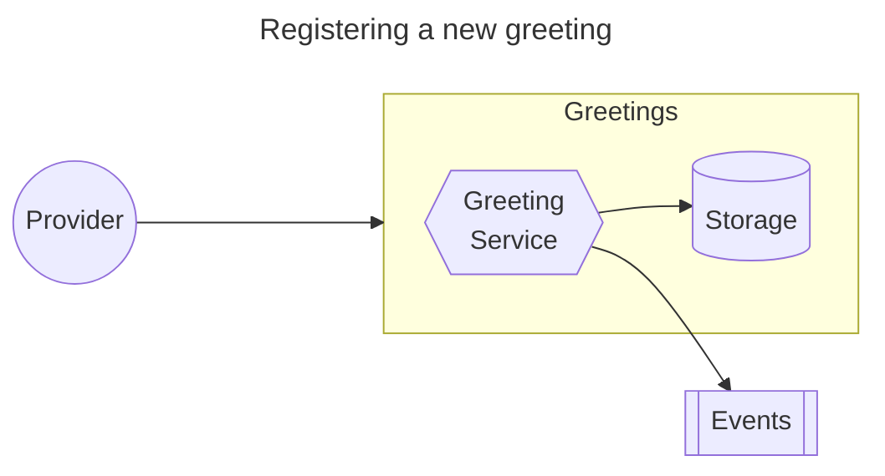

# Greetings System


Greetings messages delivered to users at login.

## Registering Greeting



```mermaid
---
title: Registering a new greeting
---
flowchart LR
    A((Provider)) ----> Greetings
    subgraph Greetings
        B{{Greeting<br/>Service}}  --> C[(Storage)]
    end
    B --> D[[Events]]
```

```mermaid

```